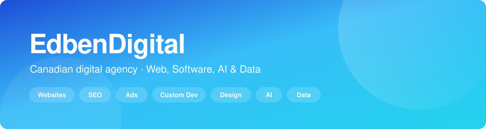

<div align="center">



<br/>

**Canadian digital agency building websites, web apps, and AI &amp; data solutions.**

[](https://edbendigital.com)
[](https://www.linkedin.com/company/edbendigital/)
[](https://www.instagram.com/edbendigital/)
[](https://www.facebook.com/profile.php?id=61593698622007)
[](mailto:contact@edbendigital.com)

</div>

---

## About us

**EdbenDigital** helps businesses build, improve, and scale their digital presence.

We cover the full stack, from the first design decision to the data pipeline behind it, so our clients work with **one team instead of seven vendors**. Whether you need a new website, better visibility, stronger advertising, custom software, or smarter ways to use AI and data, we build solutions around your business and its goals.

📍 Based in Canada 🇨🇦 · Working with businesses of every size

---

## What we do

| | Service | What it means for you |
|:---:|:---|:---|
| 🌐 | **Website Development** | Custom websites that are fast, responsive, and user-friendly. |
| 🔍 | **SEO** | Technical, on-page, and local SEO that drives organic traffic. |
| 📣 | **Digital Advertising** | High-performing paid campaigns that reach the right audience. |
| ⚙️ | **Custom Development** | Web apps, mobile apps, internal tools, and business systems. |
| 🎨 | **Media &amp; Design** | Brand identity, UI/UX, graphic design, photo, and video. |
| 🧠 | **Artificial Intelligence** | Automation, chatbots, machine learning, and predictive analytics. |
| 📊 | **Data Solutions** | Analytics, dashboards, data engineering, and BI reporting. |

---

## How we work

```
Discovery  →  Strategy  →  Design  →  Build  →  Launch  →  Measure & Improve
```

**Discovery:** We learn your business, your customers, and what success looks like.
**Strategy:** We map the shortest path from where you are to that outcome.
**Design:** Clean, modern interfaces built around how people actually use them.
**Build:** Well-structured, maintainable, scalable code.
**Launch:** Tested, secure, and monitored from day one.
**Measure &amp; Improve:** Real data drives the next iteration.

---

## Tech we work with


---

<div align="center">

## Have a project in mind?

We'd like to hear about it.

[**🌐 edbendigital.com**](https://edbendigital.com) &nbsp;·&nbsp; [**📩 contact@edbendigital.com**](mailto:contact@edbendigital.com)

[**LinkedIn**](https://www.linkedin.com/company/edbendigital/) &nbsp;·&nbsp; [**Instagram**](https://www.instagram.com/edbendigital/) &nbsp;·&nbsp; [**Facebook**](https://www.facebook.com/profile.php?id=61593698622007)

<sub>Built by EdbenDigital · Canada 🇨🇦</sub>

</div>
